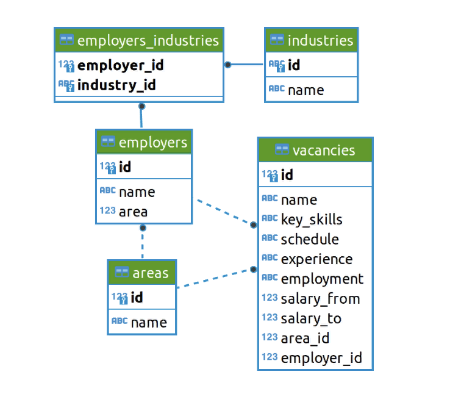
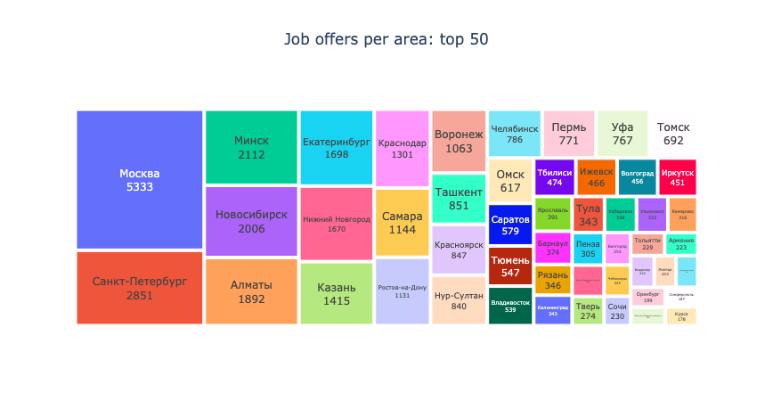
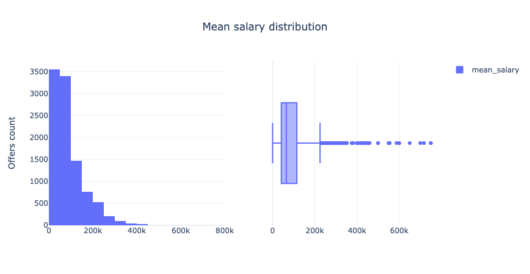
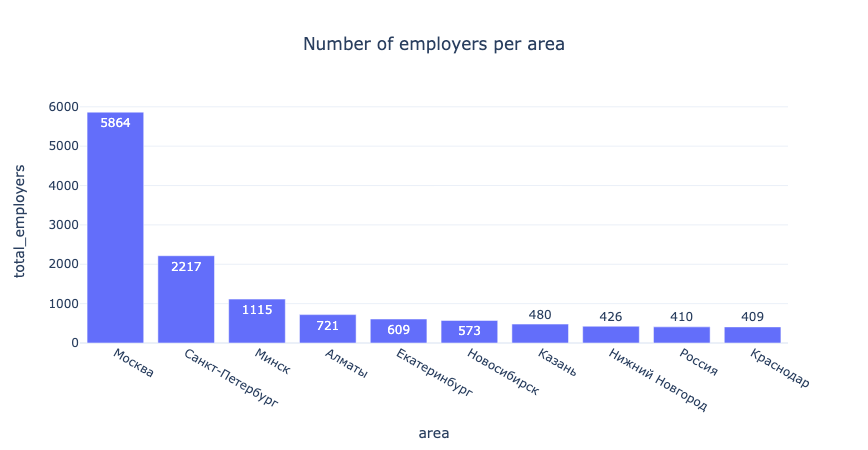

# Analysis of job offers available at hh.ru
[Link](Analysis_job_offers.ipynb)

## Project overview

The project involves the analysis of a jobs database obtained from the job search website hh.ru. This database serves to match job seekers with suitable job vacancies and vice versa, connecting employers with suitable specialists.

### The dataset schematic representation:

## Project objective

The objective of the project is to apply SQL knowledge to a database containing HeadHunger job openings. Through SQL queries, various analyses were conducted to uncover patterns within the data. 

## Project stages 

1. __Preliminary job offer analysis:__ An exploration of the data structure to gain insights into its organization and layout.
2. __Detailed job offer analysis:__ A deeper dive into the 'vacancies' table, aiming for better understanding of the specifics of each job opening, including factors such as job requirements, qualifications, and positions available.
3. __Employer Analysis:__ A comprehensive examination to discern patterns among different employers and their corresponding job offers. This analysis sought to identify recurring trends or preferences exhibited by employers in their hiring practices.
4. __Data Science Job Openings Analysis:__ A focused analysis to gain additional insights specifically within the realm of data science job openings. This section aimed to shed light on the characteristics, trends, and demands unique to the data science industry.

# Technology stack

* SQL
* Python
* Psycopg2
* Pandas
* BeautifulSoup

# Conclusions

1. The hh.ru platform offers a comprehensive search across numerous geografic  areas and industries, providing extensive information about employers, jobs, and employees to enhance the efficiency of candidate-to-job matching. Employers on the platform range from small to large, offering candidates a wide array of options.
2. The largest employer on the platform is Yandex, providing a multitude of employment opportunities across extensive geographic areas and hiring in all major cities.
3. The most sought-after career path for job seekers appears to be software development. Despite only 7% of employers indicating they hire in this industry, 25% of the platform's postings are for software developers. Furthermore, this profession promises the highest pay, with an average of 1,000,000 rubles after only three years of industry experience.
4. Despite the great amount on IT jobs, the hh.ru platform also offers a variety of vacancies unrelated to software development, constituting 75% of the total job offers.
5. Data scientists are in demand for 1771 positions, while the overall demand for software development is 12499, meaning that data science specialists account for 14% of the most employable industry.
6. Data science presents a promising career choice with a rapid salary growth trajectory within the first three years of employment. However, the mean salary for experienced data science professionals is only around 25% of the top salary promised for the same experience level in software development, standing at 243,115 rubles for data science and 1,000,000 rubles for software development.
7. Entering the data science profession may be challenging due to a lack of employers seeking inexperienced candidates (only about 3%). Key skills for a data science specialist include Python, Machine Learning, SQL, Git, and OpenCV, most of which are covered by the current data science course at Skillfactory.ru, indicating that the programme equips data scientists candidates with the necessary skills for employability.

# Examples of visualisations

